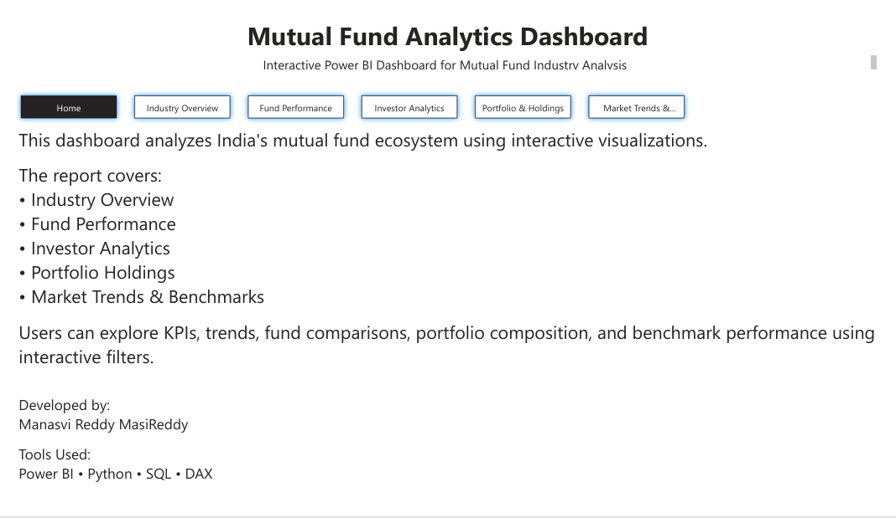
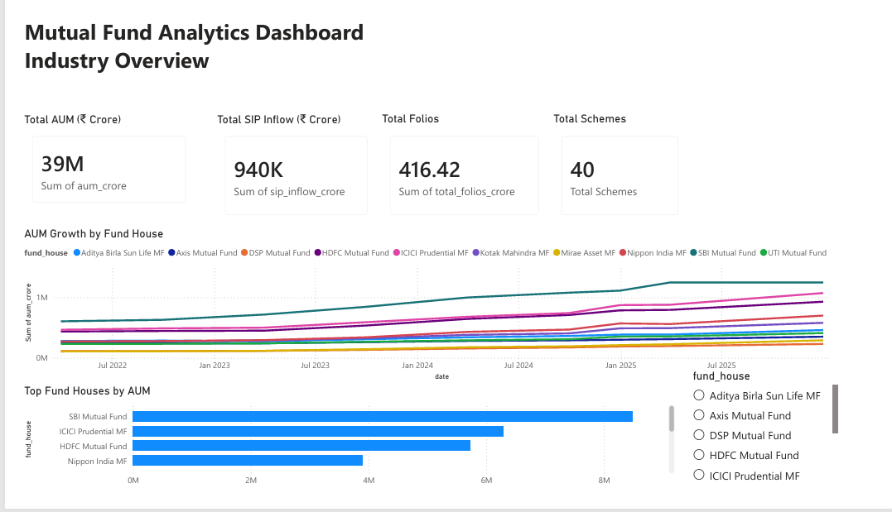
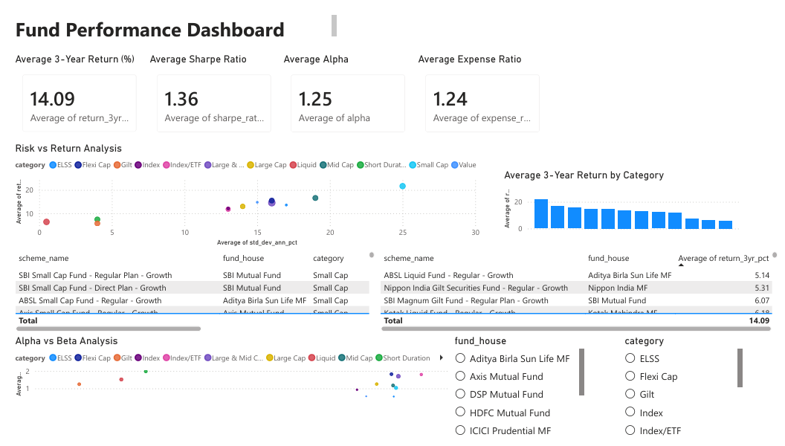
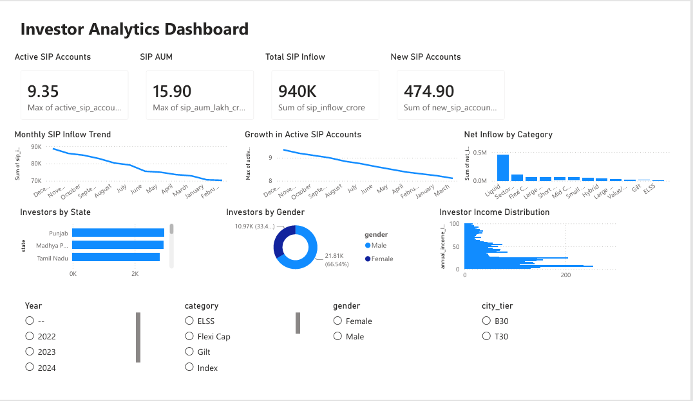
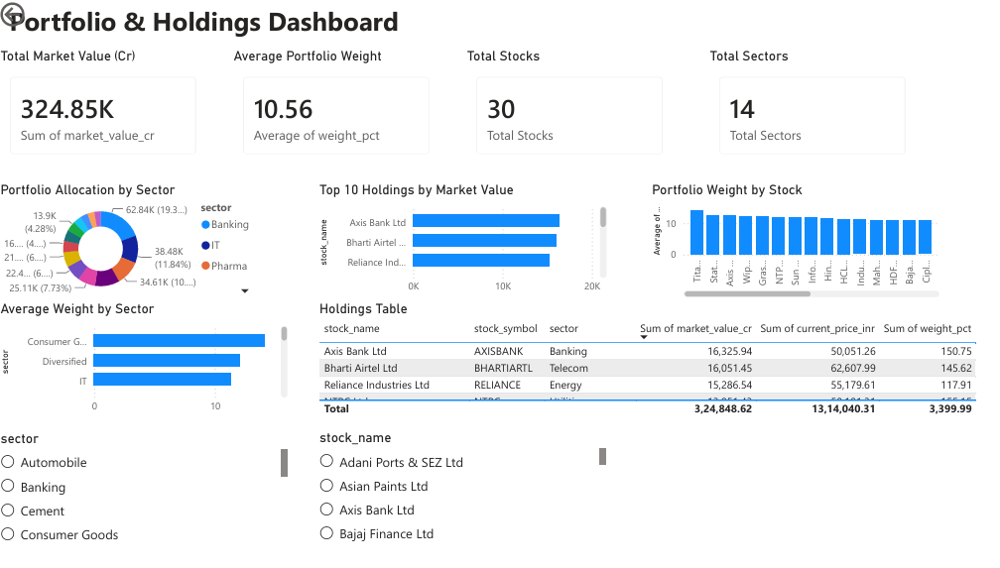
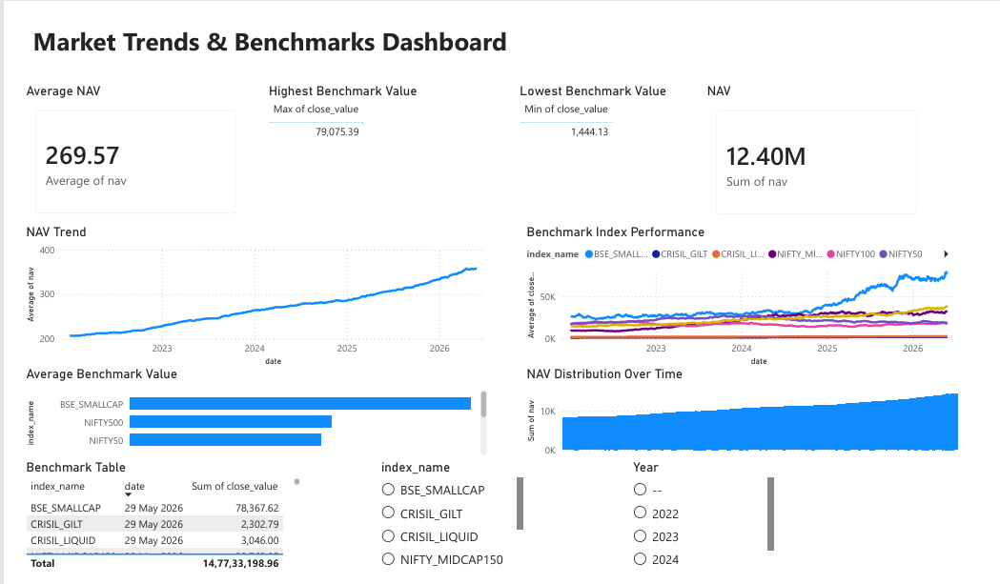

# Mutual Fund Analytics Dashboard

## Overview

The Mutual Fund Analytics Dashboard is an end-to-end Business Intelligence project developed using Power BI, Python, SQL, SQLite, and DAX. The project analyzes multiple aspects of the Indian mutual fund industry, including industry performance, mutual fund returns, investor behavior, portfolio holdings, and benchmark market trends.

The dashboard enables users to explore key financial metrics through interactive visualizations and dynamic filters, providing meaningful insights into fund performance and investment trends.

---

## Objectives

The objectives of this project are:

- Analyze the overall mutual fund industry.
- Compare the performance of mutual fund schemes.
- Study investor participation and SIP growth.
- Analyze portfolio composition and sector allocation.
- Compare benchmark indices with fund performance.
- Develop an interactive business intelligence dashboard for decision-making.

---

## Technology Stack

| Technology | Purpose |
|------------|---------|
| Power BI | Dashboard Development |
| Python | Data Cleaning and Processing |
| Pandas | Data Transformation |
| SQLite | Database Management |
| SQL | Data Extraction and Analysis |
| DAX | Calculated Measures and KPIs |
| Git & GitHub | Version Control |

---

## Project Architecture

```text
Mutual-Fund-Analytics-Dashboard/
│
├── assets/
├── dashboard/
├── data/
│   ├── raw/
│   └── processed/
├── docs/
│   └── Mutual_Fund_Analytics_Dashboard.pdf
├── notebooks/
├── reports/
├── screenshots/
│   ├── home.png
│   ├── industry_overview.png
│   ├── fund_performance.png
│   ├── investor_analytics.png
│   ├── portfolio_holdings.png
│   ├── market_trends.png
├── sql/
├── src/
├── .gitignore
├── bluestock_mf.db
├── Mutual_Fund_Analytics_Dashboard.pbix
├── README.md
└── requirements.txt
```

---

## Dashboard Structure

### Home

Landing page providing project overview and navigation to all analytical dashboards.

---

### Industry Overview

This page presents a high-level view of the mutual fund industry through key performance indicators and industry trends.

**Key Components**

- Total Assets Under Management (AUM)
- Total Mutual Fund Schemes
- Total SIP Collection
- Total Folios
- AUM Growth Analysis
- Top Fund Houses

---

### Fund Performance

Provides comparative analysis of mutual fund performance using risk and return metrics.

**Key Components**

- Risk vs Return Analysis
- Alpha vs Beta Analysis
- Fund Scorecard
- Category-wise Performance
- Top Performing Funds
- Performance KPIs

---

### Investor Analytics

Focuses on investor participation and SIP growth trends.

**Key Components**

- Monthly SIP Trend
- Active SIP Accounts
- Category-wise Inflows
- Investor Demographics
- Geographic Distribution
- Age Group Analysis

---

### Portfolio & Holdings

Provides insights into portfolio composition and investment allocation.

**Key Components**

- Portfolio Allocation
- Sector-wise Holdings
- Top Holdings
- Portfolio Weight Analysis
- Holdings Summary

---

### Market Trends & Benchmarks

Analyzes benchmark indices and historical NAV performance.

**Key Components**

- NAV Trend
- Benchmark Performance
- Historical Market Analysis
- Benchmark Comparison

---

## Dashboard Preview

### Home



---

### Industry Overview



---

### Fund Performance



---

### Investor Analytics



---

### Portfolio & Holdings



---

### Market Trends & Benchmarks



---

## Key Features

- Interactive multi-page Power BI dashboard
- Dynamic KPI cards
- Interactive slicers and filters
- Risk and return analysis
- Portfolio allocation analysis
- Benchmark comparison
- Investor analytics
- DAX-based calculations
- Professional dashboard navigation

---

## Data Sources

The project integrates multiple datasets related to the Indian mutual fund industry, including:

- NAV History
- Scheme Performance
- Industry AUM
- Monthly SIP Inflows
- Category Inflows
- Industry Folio Count
- Investor Transactions
- Portfolio Holdings
- Benchmark Indices

The datasets were cleaned, validated, and transformed using Python before being imported into Power BI.

---

## Business Insights

The dashboard enables stakeholders to:

- Monitor industry growth.
- Compare fund performance across categories.
- Evaluate risk-adjusted returns.
- Analyze investor participation trends.
- Understand portfolio diversification.
- Study benchmark index performance.
- Support investment-related decision making.

---

## How to Use

### Clone the Repository

```bash
git clone https://github.com/ManasviReddy06/mf-analytics-project.git
```

### Open the Dashboard

Open the following file using **Microsoft Power BI Desktop**:

```
Mutual_Fund_Analytics_Dashboard.pbix
```

Refresh the data model if required.

---

## Documentation

A PDF version of the dashboard is available in:

```
docs/Mutual_Fund_Analytics_Dashboard.pdf
```

---

## Repository Contents

- Power BI Dashboard (.pbix)
- Project Documentation
- Source Code
- SQL Scripts
- Processed Reports
- Dataset
- Dashboard Screenshots

---

## Learning Outcomes

This project demonstrates practical experience in:

- Business Intelligence
- Data Visualization
- Financial Analytics
- Dashboard Design
- Data Modeling
- DAX
- SQL
- Python
- Power BI Development

---

## Future Scope

Possible enhancements include:

- Real-time market data integration
- Scheduled data refresh
- Predictive analytics
- Portfolio forecasting
- Advanced drill-through reports
- Mobile dashboard optimization

---
AMFI + mfapi

↓

Python ETL

↓

SQLite Database

↓

Power BI

↓

Dashboard

## Author

**Manu Reddy**

Bachelor of Technology (Computer Science and Engineering)

GitHub: https://github.com/ManasviReddy06

---

## License

This project is intended for educational and portfolio purposes.